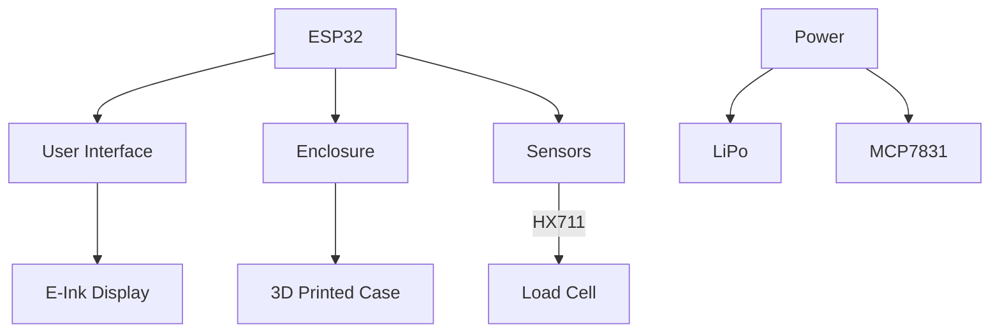

# Major Moving Parts
- Power
    - Battery
        - LIPO
            - MCP73831-based circuit for charging
- UI
    - Display
    - Buttons
- Enclosure
    - Laser Cut Acrylic
    - 3D Printed
- Microcontroller
    - ESP32
- Sensors
    - Load Cell
    - HX711
# Sections/Block Diagram

# Design Approaches
- LiPo because we wanted to incorporate this type of power cell
- Chose ESP32 for its IoT capabilities i.e WiFi and Bluetooth
- Uses an E-ink display over LCD/LED to save on power consumption
- Uses an HX711 to interface with the load cell easily

# Major Component Selection
- MCP73831: https://www.digikey.com/en/products/detail/microchip-technology/MCP73831T-2ACI-OT/964301
- LiPo Battery: https://www.digikey.com/en/products/detail/sparkfun-electronics/PRT-13851/6605199
- eInk Display: https://www.digikey.com/en/products/detail/adafruit-industries-llc/1028/10650647
- ESP32: https://www.digikey.com/en/products/detail/adafruit-industries-llc/5885/22596418
- Load Cell: https://www.digikey.com/en/products/detail/adafruit-industries-llc/4540/12323569
- HX711 Breakout: https://www.digikey.com/en/products/detail/adafruit-industries-llc/5974/24639130